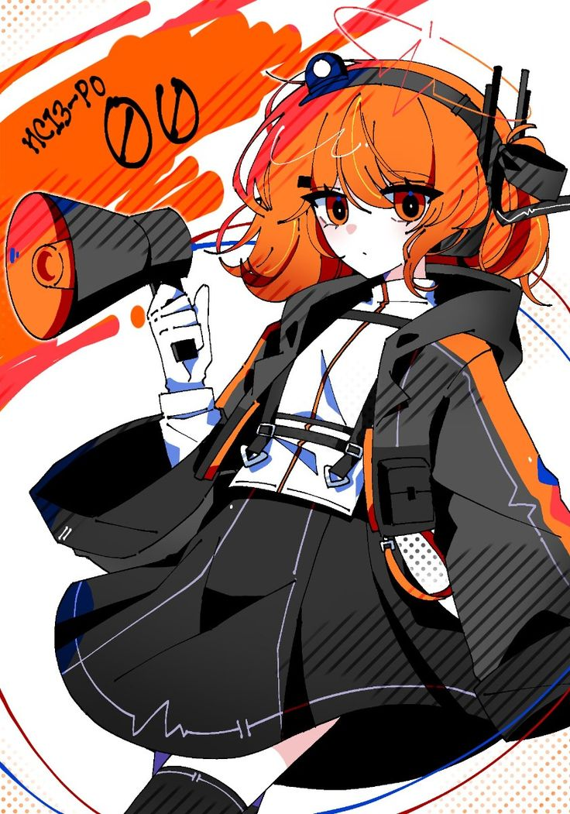

  

## Competitive Programming & Math

Focused on algorithms, data structures, and mathematical problem solving.
Interested in graph theory, discrete mathematics, and efficient solutions.
Currently training for OBI.

---

## Competitive Programming Resources

### References & Roadmaps
- **[NOIC OBI Roadmap](https://noic.com.br/materiais-informatica/roteiro-de-estudos/)** — Excellent OBI roadmap in Portuguese.
  > Some problem links on the site aren't working, but you can copy the link, grab the problem ID/number, and search for it on the equivalent site. The roadmap is fully in C++, which is currently required for IOI.
- **[USACO Guide](https://usaco.guide/)** — Well-structured roadmap with curated problems organized by difficulty. Great complement to NOIC's roadmap even if you're not doing USACO. Also has a lot of good problems: (https://usaco.guide/problems)
- **[CP-Algorithms](https://cp-algorithms.com/)** — Reference for algorithms and data structures with C++ implementations. Useful to consult when studying a specific topic.

---

### Brazilian Judges
- **[Neps Academy](https://neps.academy/br/practice-tests)** — Good for beginners + OBI practice. Simple submission process.
- **[Beecrowd](https://judge.beecrowd.com/pt/categories)** — Large Brazilian community, but problems become easy after a while and the mobile experience is poor. Best used when it appears in NOIC's roadmap, though feel free to explore.
- **[SPOJ BR](https://br.spoj.com/problems/obi/)** — Probably only use if it appears in NOIC's roadmap.

---

### International Judges
- **[VJudge](https://vjudge.net/problem)** — Useful for searching UVA problems since the original UVA site no longer works. Probably only use if UVA appears in NOIC's roadmap.
- **[CSES Problem Set](https://cses.fi/problemset/)** — Organized by topic, intermediate to advanced. Highly recommended for submissions.
- **[Codeforces](https://codeforces.com/problemset)** — Most popular competitive programming site. Problems tend to be harder.
- **[AtCoder](https://atcoder.jp/)** — Well-scheduled contests with good difficulty balancing. Highly recommended for submissions.

---

  

